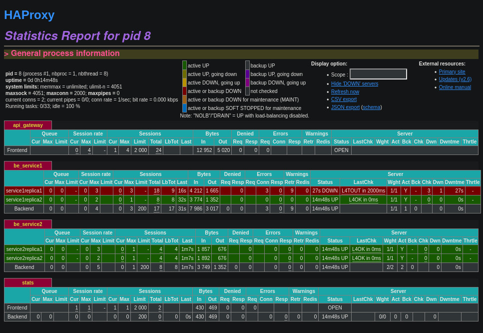

# HAProxy load balancer HTTP (level 7)

## Running with docker-compose

* Go to aas folder and clone repository from GitLab:


* Copy dot_env_example o rename it to ```.env```

```bash
cp dot_env_example .env
```

* Launch application using docker-compose:
```bash
docker-compose up -d
```

## Try it

### No API Gateway

#### Testing Service 1

Open Service 1 Replica 1 ([http://localhost:17011/service1](http://localhost:17011/service1))
in the browser (in linux you can also open it IP directly 
[http://192.168.17.11:8000/service1](http://192.168.17.11:8000/service1))
should always return:
*Executing Service 1 (by s1rep1)*


Open Service 1 Replica 2 ([http://localhost:17012/service1](http://localhost:17012/service1))
in the browser (in linux you can also open it IP directly 
[http://192.168.17.12:8000/service1](http://192.168.17.12:8000/service1))
should always return:
*Executing Service 1 (by s1rep2)*


#### Testing Service 2

Open Service 2 Replica 1 ([http://localhost:17021/service2](http://localhost:17021/service2))
in the browser (in linux you can also open it IP directly 
[http://192.168.17.21:8000/service2](http://192.168.17.21:8000/service2))
should always return:
*Executing Service 2 (by s2rep1)*


Open Service 2 Replica 2 ([http://localhost:17022/service2](http://localhost:17022/service2))
in the browser (in linux you can also open it IP directly 
[http://192.168.17.22:8000/service2](http://192.168.17.22:8000/service2))
should always return:
*Executing Service 2 (by s2rep2)*

### API Gateway

#### Call services through the API Gateway:

* If you open [http://localhost:17000/](http://localhost:17000/) in the browser, 
as no one is listening ```/``` path, it should return:
*503 Service Unavailable*

* If you open [http://localhost:17000/service1](http://localhost:17000/service1) in the browser, 
it should alternate return:
*Executing Service 1 (by s1rep1)*  / *Executing Service 1 (by s1rep2)*
    * If you kill one of the replica containers, just the other container will answer.*

* If you open [http://localhost:17000/service2](http://localhost:17000/service2) in the browser, 
it should alternate return:
*Executing Service 2 (by s2rep1)*  / *Executing Service 2 (by s2rep2)*
    * If you kill one of the replica containers, just the other container will answer.*

#### API Gateway Stats

You can visit [http://localhost:17001/](http://localhost:17001/) to see services health, 
entering ```admin``` as username and password (not recommended on production).

In the image below we can see the 4 replicas, and that service1replica1 is down.
